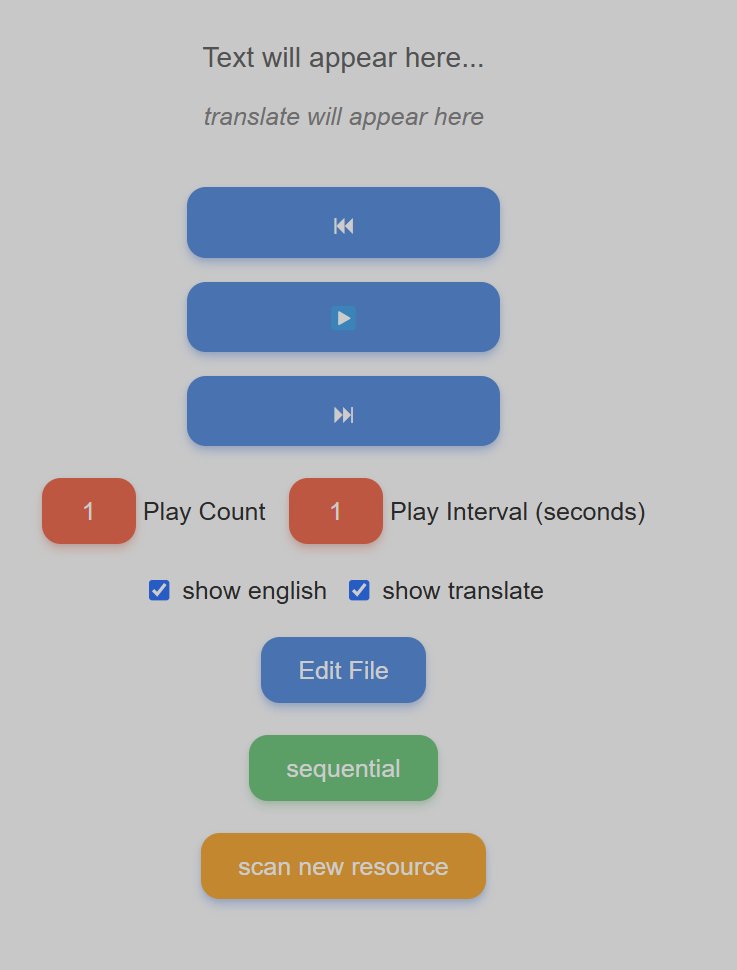
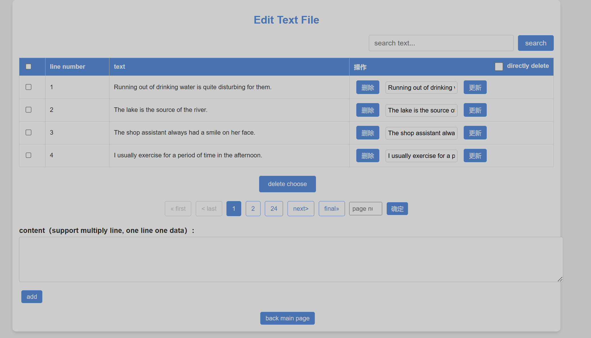

## Introduction

This project is a Flask-based web application designed to practice English listening skills.

1. Clone the repository:
   ```bash
   git clone [repository URL]
   cd [repository directory]
   ```
2. Install the required packages:
   ```bash
   pip install Flask Flask-Session gTTS deep-translator
   ```
3. Initialize the application:
   ```bash
   python app.py
   ```

#### Follow the console output to access the application locally

## Interface




## How to Use
##### 'scan new resource' button: Scans for new resources
##### 'sequential' button: Click to toggle playback mode
##### 'Edit File' button: Enter the editing page, offering CRUD operations for sentences.

---